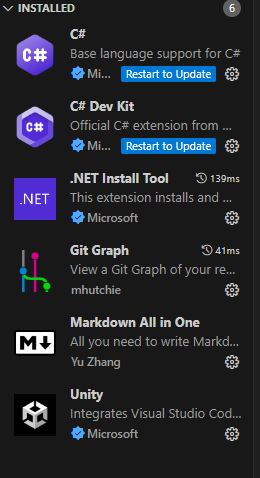

# Apuntes de Markdown

## Esto es menos importante

### Esto es aun menos importante

**Marcado**.

*Cursiva*.

Esto es una prueba de texto en MarkDown, con "shift + alt + a" 
puedes comentar/descomentar   varias lineas de codigo en VSC. No te olvides de poner el punto al final del paragrafo en MarkDown.
<!-- VSC ya se encarga de saber cual el metodo de comentado en cada
archivo cuando haces "shift + alt + a",
arriba utilice   para hacer un salto de linea -->

>codigo

- Lista desordena
- Sigo con la lista
- Fin

1. Lista ordenada
2. Sigo
3. Fin

~~algo tachado~~

---

Lineas por debajo o arriba

---

[Esto es un enlace](https://www.markdownguide.org/cheat-sheet/)

### Esto es un recordatorio de los comandos que hay que utilizar en la instalación de **GIT**

>git config --global user.name "Tu nombre de usuario"

>git config --global user.email TuCorreoElectronico

>git lfs install

>ssh-keygen -t ed25519 -C "TuCorreoElectronico"

#### Añadimos la clave creada en nuestro perfil de git-hub

#### Para crear y trabajar en nuestra rama utilizamos los siguientes comandos

>git branch NombreDeLaRamaQueQuieresCrear

>git checkout NombreDeLaRamaQueQuieresCrear

>git add .

>git commit -m "Información acerca de lo que cambiamos"

>git push origin NombreDeLaRamaQueQuieresCrear
